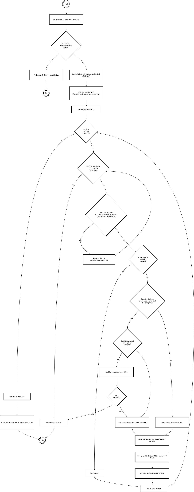
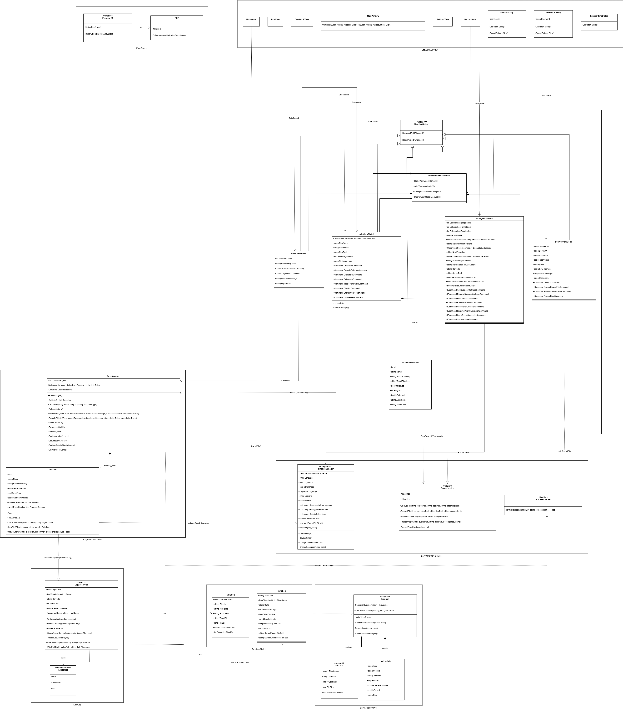
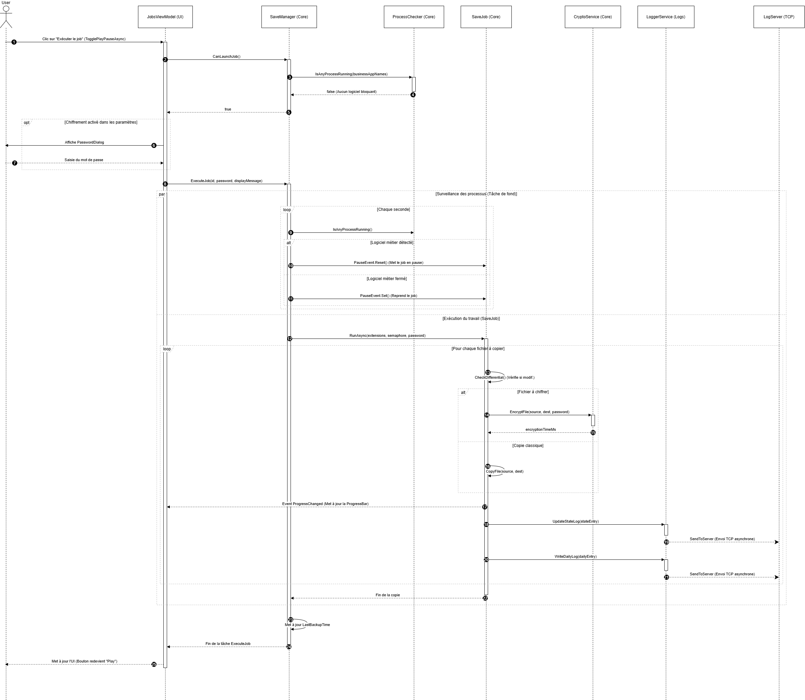

# Introduction to EasySave

EasySave is built using a multi-tiered architecture in C# (.NET 10.0) following MVVM principles for the UI and strict separation of concerns for the core engine.

## Architecture Overview

The solution is divided into distinct projects:
1. **EasySave.Core**: The core engine handling save jobs, state management, and cryptography.
2. **EasyLog**: A dedicated logging system capable of outputting to local files or a remote server.
3. **EasyLog.LogServer**: A standalone TCP server for remote log aggregation.
4. **EasySave.UI**: The AvaloniaUI-based cross-platform graphical interface.

## System Diagrams

### Activity Flow

### Use Case Analysis

### Class Analysis

### Sequence Analysis
